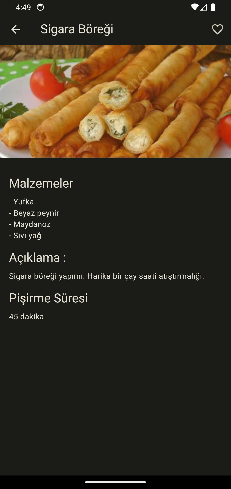

# mealsapp

Flutter provider yönetimi ile geliştirilmiş yemek tariflerini içeren bir mobil uygulamadır.

## Özellikler

Anasayfa : Yemek kategorilerinin listelendiği kısım.
 
Drawer : Menü de kullanıcı favori listesini profil geçişlerini öneri sayfasını yardım ve uygulama hakkında içerikleri görmektedir.

## Kullanılan Teknolojiler

Flutter: UI geliştirmek için kullanılan çerçeve.
 
Provider: State yönetimi için kullanılan paket.

  

